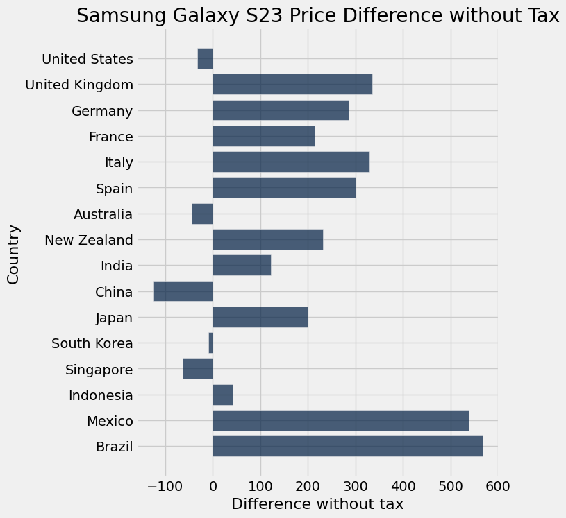

# The Samsung Galaxy S23 Price Index

### Group Members: Ellie Liao, Nate Arams, Reece Jurgens

Source: https://recy-cell.ca/en/products/samsung-galaxy-s23/ , retrieved on December 2, 2024.

## Introduction

Nowadays, smartphones have become an essential part of our daily lives, making smartphones a perfect product of choice for a global price comparison index. Among all the different smartphone brands, the Samsung Galaxy stands out as one of the ideal choices for a price index, due to its widespread availability and popularity across the world. With its availability across different regions, it allows us to compare the price of the product from a wide variety of countries, providing meaningful insights into the concept of purchasing power parity.

### 1. Scraping the Pricing Data 

To start the project, I found a website to scrape the data from. The website (https://www.androidauthority.com/cheapest-place-to-buy-samsung-galaxy-s23-3335713/, retrieved November 25th, 2024) has a table which shows the prices of the Samsung Galaxy S23 across different countries in both the local currency as well as in USD. These prices were obtained from the samsung website in each country, and ignored local tax rates.

### 2. Cleaning the Data

The data in each of the columns had to be cleaned to be useful in the remaining portions of the analysis, and to overall be more organized.

#### For the country column:
- The world country was added to each different country, so I removed that word to make it more the table more legible
#### For the local price column:
- Each data entry was displayed as “Localprice$1,099.99”. First I made a function to clean it. The function removed the phrase “Local Price”, removed all the commas, removed each currency code, and converted it to a float. This way the data was able to be useful in later parts of the project, as well as being overall more clear. Some of this had to be done manually, as the currency codes differed in length, but most of data was able to be cleaned using the same parameters in the function.
#### For USD currency:
- For this column, I wanted to convert into CAD, as that is the comparison I wanted to make. 
- First I had to clean it, as it was displayed like “USD equivalent$799”. So we removed the phrase “USD equivalent”, the dollar sign, as well as any commas, then converted it to a float.
- To convert it to CAD, I used the conversion the original authors used, as they had data on what it cost in Canada. Then I just applied that fraction to each value to get the Canadian cost at the time the data was collected. 

### 3. Applying local taxes
To apply local tax rates, I used the website https://en.wikipedia.org/wiki/List_of_countries_by_tax_rates to find the tax rate of each country. Oftentimes there are numerous different tax rates per country, so I took the lowest tax rate under the assumption that someone would want to purchase the phone in the area of the country that has the lowest tax. I then put those in an array, added it as a column to the cleaned table, then multiplied the tax column to both the local prices and the canadian prices. I kept those as seperate columns labeled "Local Prices with Tax" and "Canadian Prices with Tax. 

### 4. Displaying the currencies by currency code

For this step, the method used was doing an online research of the currency code of each country included in the list. The source of the currency codes were from: https://openknowledge.fao.org/server/api/core/bitstreams/7d0c5832-7360-4f49-962d-ccf72338dc79/content , as I went through the document and listed them down by countries. In the code cell, the “currencies: list contains the currency codes corresponding to the countries in order, such as "USD" for the United States, "CAD" for Canada, "GBP" for the United Kingdom, etc. 

Next, I combined the column “currencies” with the table “Cleanedtable”, by using the Cleanedtable.with_column method to create a new table, named “table_with_currencies”, by adding the currencies list as a new column named "Currency" to the existing table, “Cleanedtable”. This shows each country's local price in the table with its respective currency.

Furthermore, in order to make “table_with_currencies” more organized visually, I added an additional code cell and made a new table named “tidied_price_table”, as I moved the column "CAD equivalent '$'" to the last column by using the .move_to_end method. The purpose of this action was to tidy up the table, and make the table seem more organized and in order.

### 5. Calculate difference and plot the differences

Since the CAD equivalent prices were already in the graph from the previous steps, this step would be to calculate the price differences of the product in each country between the price in Canada, using CAD. First, a variable named “price_differences” is calculated by subtracting the value 1099.99 (the price of the product in Canada) from the "CAD equivalent '$'" column of the “tidied_price_table”. This would result in a new array where each entry of the column would show a difference between the prices of our product in each country and the price of the product in Canada. 

I then added a new column named “Difference” to the “tidied_price_table”, and named this new table as “price_table_with_differences”. This table now includes a column with the calculated price difference between each country and Canada itself. Furthermore, since I am only looking for the price difference in each country compared to Canada, I will be excluding the price of the product in Canada, by using the .exclude method. A new table named “FINAL_price_table” is created, which consists of the price differences between each country, excluding Canada.

The last part of this step is to plot the differences between each country. This part was done by simply using the .barh method on the “FINAL_price_table”, on the “Difference” column.

As shown in the graph, you can see that the countries that you’re worst off in buying the Samsung Galaxy S23 are Mexico and Brazil. Furthermore, it can be seen that you could save more than $100 Canadian Dollars by purchasing the model Samsung Galaxy S23 in China. 

### 6. Calculating External Factors

We decided to compare the average income of each county with the difference in cost. To do this we first found the average income of each country in USD from the website worlddata.info("https://www.worlddata.info/average-income.php") and placed them into a list called income. This list was then placed into a copy of the previous table with the new name "FINAL_price_table_with_income" with a new column, "Average Income (USD)". We then created a new column by applying the previously described conversion to CAD to "Average Income (USD)" to aquire "Average Income (CAD)". After this we droped "Average Income (USD)". 

### 7. Plotting and Comparing External Factors
In order to compare the relation between average income and the difference we ploted them in a scattterplot, using the columns "Average Income (CAD)" and"Difference without tax" which resulted in this scatterplot.

As we can clearly see from this scatterplot, there is very little evident correlation between these two columns, average income does not seem to impact the price all that greatly, at least not from what we can see. There are however some more likely drivers of prices that are not as easily observed. Samsung has much less competiiton in many of these countries and can therfore charge higher prices. Import tarrifs on individual components of a phone could  jack up the price. Certain laws regarding labour standards or quality assurance would certainly also impact the price. The problem is these feilds are not easily graphed into something like a scatterplot.

## Conclusion 
Based on our findings, it's clear that you really won't save that much money by buying your Samsung Galaxy S23 in another country. But if you were looking to save about $125, the cheapest country to buy it would be China, and certainly don't buy one in Brazil as it would cost you an extra $567. As stated earlier, it does not seem as if there was significant correlation between the price of the phone, and the average income of someone living in that country. 

